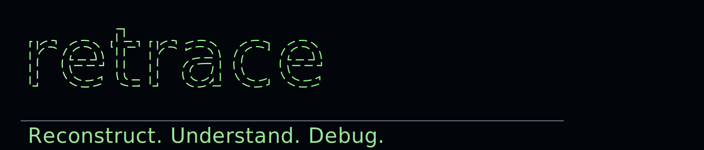

<p align="center">
  
</p>

# Retrace

Your real users are your QA team. Retrace finds the bugs they hit.

Retrace pulls PostHog session recordings, detects likely breakage with heuristic detectors, clusters similar failures, generates clear bug summaries, and outputs actionable fix prompts with likely culprit files.

## What You Get

- Session-level bug detection from rrweb data
- Clustering so repeated user failures become one issue
- LLM-written summaries and repro context
- Local UI with rrweb replay, culprit files, and copyable prompts
- GitHub repo matching via CLI-connected repo metadata
- Local Browser Harness UI tester with saved reusable specs
- Regression-state tracking for replay findings (`new`, `ongoing`, `regressed`, `resolved`)

## Quickstart

Requires Python 3.11+.

```bash
uv venv
uv pip install -e ".[dev]"
```

Set up and run:

```bash
retrace init
retrace run
```

Report output:

- `./reports/YYYY-MM-DD-HHMMSS.md`

## Local UI (Onboarding + Replay + Prompts)

```bash
retrace ui
```

Open:

- `http://127.0.0.1:8787`

From the UI you can:

- Set/edit PostHog host, project ID, and API key
- Set/edit LLM provider, base URL, model, and API key
- Save settings to `config.yaml` + `.env`
- Run system checks for:
  - PostHog connectivity
  - LLM connectivity
  - `gh` installed/authenticated
- Copy suggested terminal commands when `gh` is missing/not authed
- Browse findings from latest report
- Replay stored rrweb events
- Inspect likely culprit files and copy Codex/Claude prompts

## Fix Suggestions Workflow

1. Connect repo metadata (CLI):

```bash
retrace github connect --repo <org/name> --branch main --local-path /path/to/repo
```

2. Generate fix suggestions from latest report:

```bash
retrace suggest-fixes --latest --repo <org/name> --out ./reports/fix-prompts
```

Artifacts:

- `reports/fix-prompts/*.json`
- `reports/fix-prompts/*.codex.md`
- `reports/fix-prompts/*.claude.md`

## Core Commands

- `retrace init` — interactive setup + validation
- `retrace doctor` — health checks for config/services
- `retrace run` — one-shot ingestion, detection, clustering, report write
- `retrace ui` — local browser UI and onboarding/settings
- `retrace tester ...` — describe tests or generate suite drafts with Browser Harness
- `retrace mcp serve` — single MCP server with multiple tools (findings + tester)
- `retrace github ...` — repo metadata management
- `retrace suggest-fixes ...` — candidate matching + prompt generation

## Local UI Tester (Browser Harness First)

Retrace now includes a local-first tester workflow built around Browser Harness.

Create a reusable described test:

```bash
retrace tester create \
  --name "Signup flow" \
  --mode describe \
  --prompt "Go through signup and verify dashboard loads" \
  --app-url http://127.0.0.1:3000 \
  --start-cmd "npm run dev"
```

Create an AI suite-draft spec:

```bash
retrace tester create-suite \
  --name "Systematic app regression suite"
```

Run a saved spec:

```bash
retrace tester run <spec_id> --retries 1
```

List specs and runs:

```bash
retrace tester list
retrace tester runs
```

Spec and run artifacts are stored under:

- `data/ui-tests/specs/*.json`
- `data/ui-tests/runs/*/run.json`
- `data/ui-tests/runs/*/harness.log`

UI support:

- `retrace ui` now includes a `Local UI Tester` panel for:
  - `Describe Test` mode (per-test prompt)
  - `AI Explore Full Suite` mode (systematic suite draft)
- Onboarding includes tester auth setup (none/form/JWT/custom headers), and secret fields keep existing values when left blank.
- Tester runs are flake-aware (retry count + flake classification shown in recent runs).

## MCP Server (Single Server, Multiple Tools)

Run:

```bash
retrace mcp serve
```

Supported MCP tools:

- `retrace.list_findings`
- `retrace.list_tester_specs`
- `retrace.create_tester_spec`
- `retrace.run_tester_spec`

## Detectors (v0.1)

- `console_error`
- `network_4xx`
- `network_5xx`
- `rage_click`
- `dead_click`
- `error_toast`
- `blank_render`
- `session_abandon_on_error`

Toggle detectors in `config.yaml`.

## Runtime Data

- `config.yaml` — non-secret config
- `.env` — secrets (`RETRACE_POSTHOG_API_KEY`, optional `RETRACE_LLM_API_KEY`, optional tester auth secrets)
- LLM providers supported: `openai_compatible` (local/custom), `openai`, `anthropic`, `openrouter`
- `data/retrace.db` — run/session/findings metadata
- `data/sessions/*.json` — ingested rrweb events
- `reports/*.md` — findings reports
- `reports/fix-prompts/*` — generated fix artifacts

## CI/CD (GitHub Actions)

This repo includes `.github/workflows/ci-cd.yml` with:

- **CI on every push and pull request**
  - Python 3.11 setup
  - `uv` dependency install
  - `ruff check src tests`
  - `pytest -q`
- **Docker build validation on every push and pull request**
  - Builds `docker/Dockerfile` (no publish)
- **CD on pushes to `main`**
  - Publishes Docker image to GHCR:
    - `ghcr.io/<owner>/<repo>:sha-<commit>`
    - `ghcr.io/<owner>/<repo>:latest`

Notes:

- GHCR publishing uses `GITHUB_TOKEN` with `packages: write`.
- Secrets in `.env` are not used by CI/CD; keep runtime secrets in your deployment environment.

## Cron / Background Execution

```bash
docker compose up -d
```

Uses `RETRACE_CRON` (default every 6 hours).

## Design Docs

- `docs/superpowers/specs/2026-04-19-retrace-design.md`
- `docs/superpowers/plans/2026-04-19-retrace-plan-a-vertical-slice.md`
